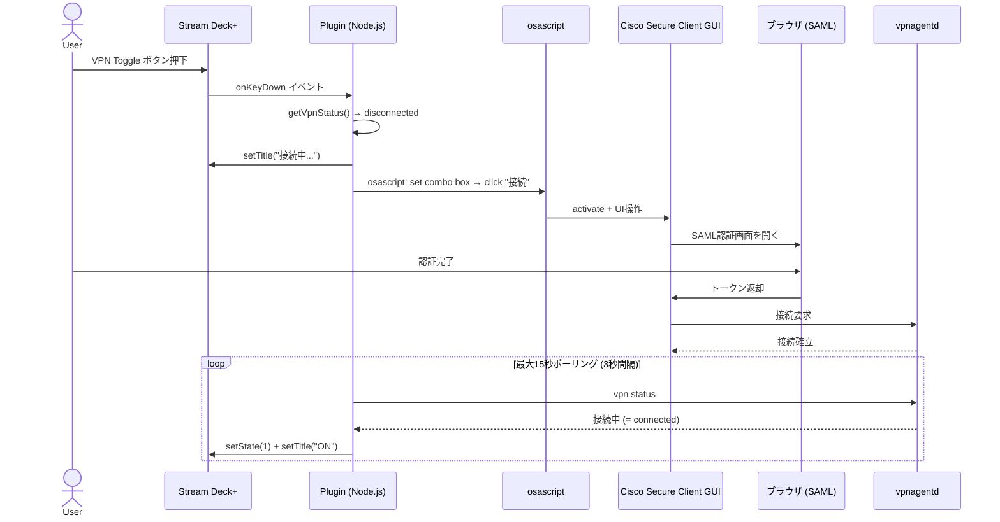
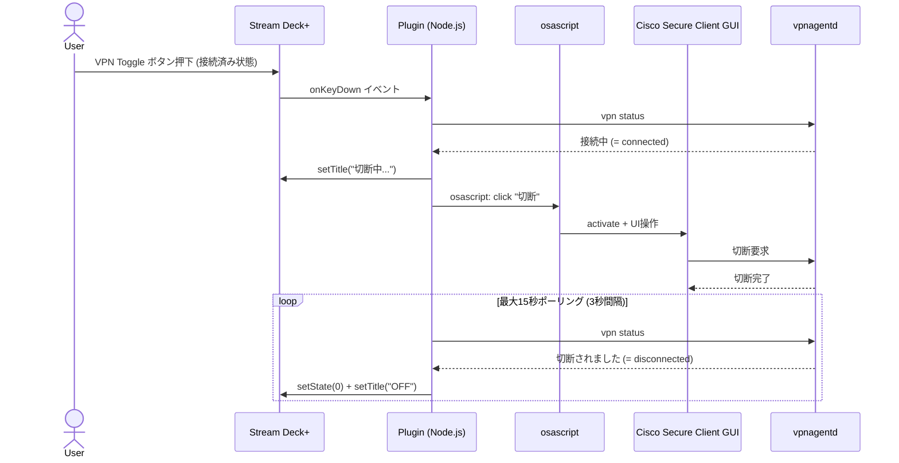
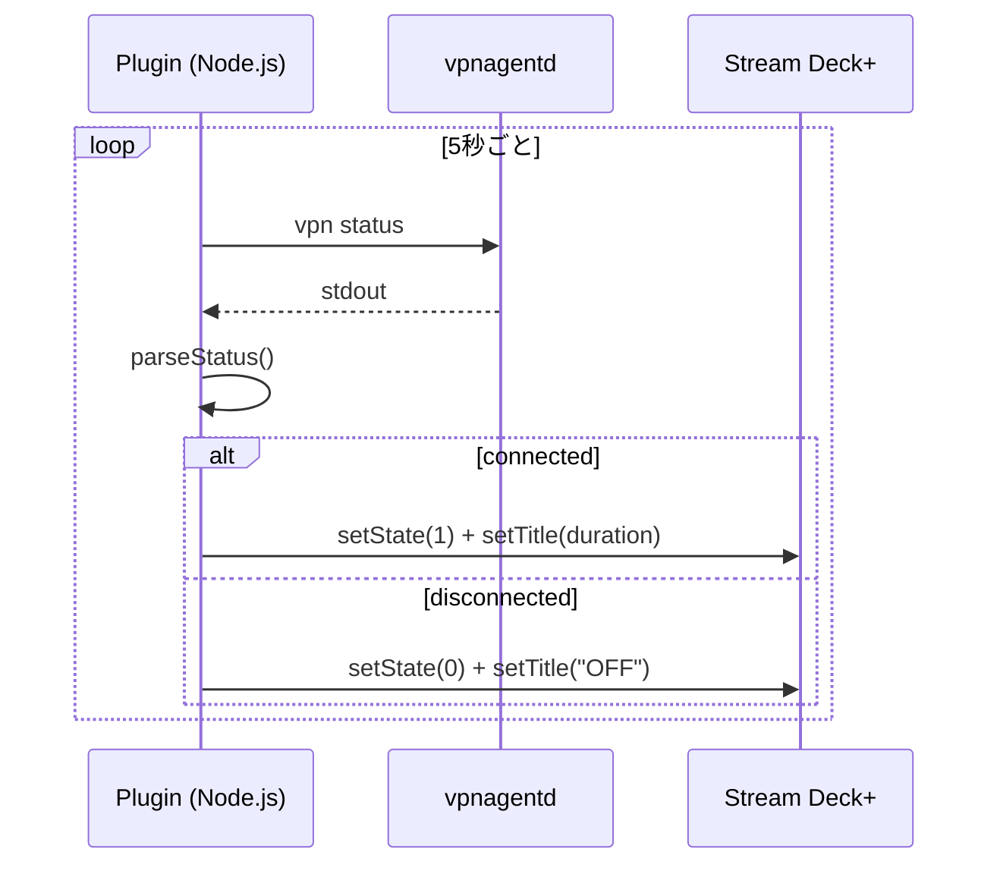

# シーケンス図

## VPN 接続フロー

```mermaid
sequenceDiagram
    actor User
    participant SD as Stream Deck+
    participant Plugin as Plugin (Node.js)
    participant AS as osascript
    participant GUI as Cisco Secure Client GUI
    participant Browser as ブラウザ (SAML)
    participant Agent as vpnagentd

    User->>SD: VPN Toggle ボタン押下
    SD->>Plugin: onKeyDown イベント
    Plugin->>Plugin: getVpnStatus() → disconnected
    Plugin->>SD: setTitle("接続中...")
    Plugin->>AS: osascript: set combo box → click "接続"
    AS->>GUI: activate + UI操作
    GUI->>Browser: SAML認証画面を開く
    User->>Browser: 認証完了
    Browser->>GUI: トークン返却
    GUI->>Agent: 接続要求
    Agent-->>GUI: 接続確立

    loop 最大15秒ポーリング (3秒間隔)
        Plugin->>Agent: vpn status
        Agent-->>Plugin: 接続中 (= connected)
        Plugin->>SD: setState(1) + setTitle("ON")
    end
```

## VPN 切断フロー

```mermaid
sequenceDiagram
    actor User
    participant SD as Stream Deck+
    participant Plugin as Plugin (Node.js)
    participant AS as osascript
    participant GUI as Cisco Secure Client GUI
    participant Agent as vpnagentd

    User->>SD: VPN Toggle ボタン押下 (接続済み状態)
    SD->>Plugin: onKeyDown イベント
    Plugin->>Agent: vpn status
    Agent-->>Plugin: 接続中 (= connected)
    Plugin->>SD: setTitle("切断中...")
    Plugin->>AS: osascript: click "切断"
    AS->>GUI: activate + UI操作
    GUI->>Agent: 切断要求
    Agent-->>GUI: 切断完了

    loop 最大15秒ポーリング (3秒間隔)
        Plugin->>Agent: vpn status
        Agent-->>Plugin: 切断されました (= disconnected)
        Plugin->>SD: setState(0) + setTitle("OFF")
    end
```

## ステータスポーリング (定期実行)

```mermaid
sequenceDiagram
    participant Plugin as Plugin (Node.js)
    participant Agent as vpnagentd
    participant SD as Stream Deck+

    loop 5秒ごと
        Plugin->>Agent: vpn status
        Agent-->>Plugin: stdout
        Plugin->>Plugin: parseStatus()
        alt connected
            Plugin->>SD: setState(1) + setTitle(duration)
        else disconnected
            Plugin->>SD: setState(0) + setTitle("OFF")
        end
    end
```
